# UML — Eisenhower Tasks

> Gerado automaticamente. Atualizar sempre que a estrutura do projeto mudar.

```mermaid
classDiagram
    %% ─── DATA MODELS ───────────────────────────────────────────────────────────

    class Task {
        +String id
        +String title
        +String description
        +Boolean urgent
        +Boolean important
        +String quadrant
        +String status
        +String due_date
        +String category
        +String delegated_to
        +String recurrence
        +String recurrence_end
        +String created_at
    }

    note for Task "status: pending | in_progress | review\n        | blocked | completed | cancelled\noverdue: computed (due_date < today && active)"

    class StatusHistory {
        +String id
        +String task_id
        +String from_status
        +String to_status
        +String changed_at
        +String note
        +String user_id
    }

    class Person {
        +String id
        +String name
        +String role
        +String sector
        +String hierarchy
        +String slackId
        +String whatsapp
        +String created_at
    }

    class Block {
        +String id
        +String title
        +String date
        +String start_time
        +String end_time
        +String task_id
        +String color
        +Boolean locked
        +String recurrence
        +String recurrence_end
    }

    class Settings {
        +Boolean assistantEnabled
        +Boolean aiEnabled
        +String aiProvider
        +String aiModel
        +Object aiKeys
        +String slackBotToken
        +Boolean onboardingCompleted
        +Anamnesis anamnesis
    }

    class Anamnesis {
        +Number urgencyDeadlineDays
        +String[] urgencyTriggers
        +String[] urgencyContexts
        +String[] importanceAreas
        +String[] importanceTriggers
        +String[] importanceContexts
        +Boolean hasDelegation
        +String[] delegatableTriggers
        +String[] delegatableCategories
    }

    class ClassificationResult {
        +Boolean urgent
        +Boolean important
        +String quadrant
        +Number confidence
        +String[] reasons
    }

    class ChatMessage {
        +String role
        +String content
        +Object action
        +Boolean success
        +String error
    }

    class SLAResult {
        +Number leadTime
        +Number cycleTime
        +Boolean slaOk
        +Number daysLate
        +Number timeBlockedDays
        +StatusHistory[] history
    }

    Settings *-- Anamnesis
    Task "1" --> "0..*" StatusHistory : transitions

    %% ─── STATUS MACHINE ──────────────────────────────────────────────────────

    note for StatusHistory "Transitions:\npending → in_progress, cancelled\nin_progress → review, blocked, completed, cancelled\nreview → in_progress, completed, cancelled\nblocked → in_progress, cancelled\ncompleted → pending\ncancelled → pending"

    %% ─── HOOKS ─────────────────────────────────────────────────────────────────

    class useAuth {
        -Object session
        +Object user
        +String accessToken
        +Boolean loading
        +signIn(email, password) Promise
        +signUp(email, password, name) Promise
        +signOut() Promise
        +refreshSession() Promise
    }

    class useTasks {
        -String mode
        -Ref tasksRef
        -Ref serverModeRef
        +Task[] tasks
        +StatusHistory[] statusHistory
        +Boolean loading
        +Boolean serverMode
        +createTask(data) Promise
        +updateTask(data, note) Promise
        +deleteTask(id) Promise
        +toggleStatus(task) Promise
    }

    class usePeople {
        +Person[] people
        +createPerson(data) Promise
        +updatePerson(data) Promise
        +deletePerson(id) Promise
    }

    class useSettings {
        +Settings settings
        +save(patch) void
        +saveAnamnesis(anamnesisPatch, overrides) void
        +toggleAssistant() void
    }

    class useNotifications {
        +Number overdueCount
        +requestPermission() Promise
    }

    useTasks ..> Task : manages
    useTasks ..> StatusHistory : records
    usePeople ..> Person : manages
    useSettings ..> Settings : manages

    %% ─── UTILITY MODULES ────────────────────────────────────────────────────────

    class statusConfig {
        +STATUS_CONFIG Object
        +STATUS_TRANSITIONS Object
        +DONE_STATUSES String[]
        +calcQuadrant(urgent, important) String
    }

    class classifier {
        +classifyTask(title, dueDate, anamnesis) ClassificationResult
        +quadrantLabel(q) String
    }

    class aiClassifier {
        +PROVIDERS Object
        +classifyTaskWithAI(title, dueDate, anamnesis, config) Promise~ClassificationResult~
        -buildPrompt(title, dueDate, anamnesis) String
        -parseResult(text) ClassificationResult
    }

    class aiProxy {
        -String _token
        +setProxyToken(token) void
        +callViaProxy(opts) Promise~String~
    }

    class dataApi {
        +setAuthToken(token) void
        +setUnauthorizedHandler(fn) void
        +isServerUp() Promise~Boolean~
        +resetServerStatus() void
        +tasks TaskEndpoint
        +people PeopleEndpoint
        +blocks BlocksEndpoint
        +status_history StatusHistoryEndpoint
        +sync(tasks, people, blocks) Promise
    }

    class slack {
        +slackCall(method, token, body) Promise
        +openDM(token, userId) Promise~String~
        +sendSlackMessage(token, userId, text, blocks) Promise
        +buildBlocks(message, task) Object[]
        +taskQuadrant(task) String
    }

    classifier ..> ClassificationResult : returns
    aiClassifier ..> ClassificationResult : returns
    aiClassifier ..> Anamnesis : uses
    aiClassifier ..> aiProxy : calls
    aiProxy ..> dataApi : shares token
    dataApi ..> StatusHistory : persists

    %% ─── COMPONENTS ─────────────────────────────────────────────────────────────

    class App {
        -String view
        -Object modal
        -Boolean chatOpen
        +render() JSX
    }

    class Matrix {
        -String search
        -String filterCategory
        -String filterPerson
        -String filterStatus
        -String sortBy
        -Boolean showCompleted
        -Number colPct
        -Number rowPct
        +tasks Task[]
        +people Person[]
        +onNew(quadrant) void
        +onEdit(task) void
        +onDelete(id) void
        +onToggle(task) void
        +onMoveTask(task) void
    }

    class TaskModal {
        -Object form
        -ClassificationResult suggestion
        -Boolean aiLoading
        -String aiError
        -Boolean notifySlack
        -String slackStatus
        +task Task
        +people Person[]
        +assistantEnabled Boolean
        +aiConfig Object
        +anamnesis Anamnesis
        +slackBotToken String
        +onSave(form) void
        +onClose() void
    }

    note for TaskModal "Status selector shows current status\n+ valid transitions from statusConfig"

    class Agenda {
        -Date selectedDate
        -Date weekStart
        -Block[] blocks
        -Object modal
        +tasks Task[]
    }

    class People {
        -String search
        +people Person[]
        +tasks Task[]
        +slackBotToken String
        +onCreate(data) void
        +onUpdate(data) void
        +onDelete(id) void
    }

    class History {
        +tasks Task[]
        +statusHistory StatusHistory[]
        +onDelete(id) void
        +onToggle(task) void
        -computeSLA(task, history) SLAResult
        -compliance Number
        -avgLead Number
        -avgCycle Number
    }

    note for History "SLA metrics:\n- Conformidade (% no prazo)\n- Lead time médio\n- Cycle time médio\nPer-task: timeline de transições"

    class SettingsComponent {
        +settings Settings
        +onSave(patch) void
        +onRestartOnboarding() void
    }

    class Onboarding {
        -Number step
        -Object data
        +onComplete(anamnesis) void
    }

    class AuthScreen {
        -String tab
        -String email
        -String password
        -String name
        -Boolean loading
        +onSignIn(email, password) Promise
        +onSignUp(email, password, name) Promise
    }

    class ChatPanel {
        -ChatMessage[] messages
        -String input
        -Boolean loading
        -String error
        +tasks Task[]
        +people Person[]
        +aiConfig Object
        +onClose() void
        +onCreateTask(data) Promise
        +onCreatePerson(data) Promise
        +onCreateBlock(data) Promise
        -buildSystemPrompt() String
        -parseActions(text) Object[]
    }

    note for ChatPanel "messages persisted to localStorage\n(eisenhower-chat, max 50)\nAI calls routed via /api/classify proxy"

    class SlackComposer {
        -String message
        -Task selectedTask
        -Person[] mentions
        -String status
        +person Person
        +tasks Task[]
        +people Person[]
        +slackBotToken String
        +onClose() void
    }

    %% ─── COMPONENT RELATIONSHIPS ─────────────────────────────────────────────

    App *-- Matrix
    App *-- Agenda
    App *-- People
    App *-- History
    App *-- SettingsComponent
    App *-- TaskModal
    App *-- ChatPanel
    App *-- Onboarding
    App *-- AuthScreen

    App --> useAuth
    App --> useTasks
    App --> usePeople
    App --> useSettings
    App --> useNotifications

    Matrix ..> Task : displays
    Matrix ..> Person : references
    Matrix ..> statusConfig : uses

    TaskModal ..> Task : edits
    TaskModal ..> Person : lists
    TaskModal ..> classifier : uses
    TaskModal ..> aiClassifier : uses
    TaskModal ..> slack : sends via
    TaskModal ..> statusConfig : uses

    Agenda ..> Block : manages
    Agenda ..> Task : links

    People ..> Person : displays
    People ..> Task : groups
    People *-- SlackComposer

    History ..> Task : shows done
    History ..> StatusHistory : reads
    History ..> SLAResult : computes
    History ..> statusConfig : uses

    ChatPanel ..> Task : reads
    ChatPanel ..> Person : reads
    ChatPanel ..> aiProxy : calls

    SlackComposer ..> Person : targets
    SlackComposer ..> Task : attaches
    SlackComposer ..> slack : sends via

    useTasks --> dataApi : delegates
    usePeople --> dataApi : delegates
    useSettings --> dataApi : syncs
```

## Como atualizar

Sempre que houver mudanças significativas na arquitetura (novos modelos, hooks, componentes ou utilitários), regenere este arquivo refletindo:

- Novos campos em modelos de dados
- Novos hooks ou mudança de interface
- Novos componentes ou remoção de existentes
- Novas integrações externas
- Mudanças na máquina de estados de status
